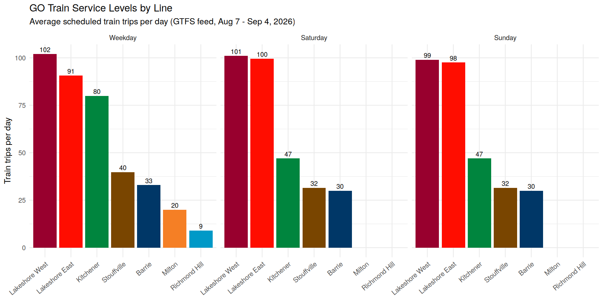
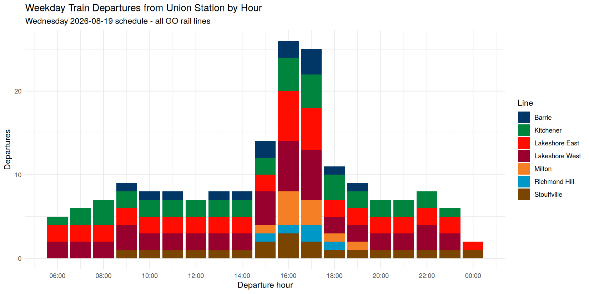
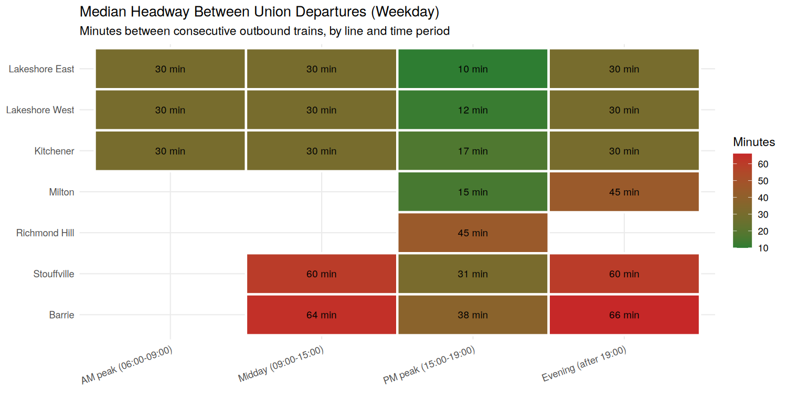

# GO Transit Service-Level & Headway Analysis

**[▶ Live interactive dashboard](https://YOUR-USERNAME.github.io/go-transit-service-analysis/)** — filter by day type, hover for details, dark mode, data-table view.

An analysis of GO Transit's rail schedule using Metrolinx's open GTFS data and R. It measures how much train service each of the seven GO rail lines runs, when that service is concentrated, and how long passengers wait between trains at Union Station.

Built as a portfolio project around the work of a rail operations planning team: service levels, headways, and span of service are the core metrics used when designing and evaluating timetables.

## Data

- **Source:** [Metrolinx Open Data](https://www.metrolinx.com/en/about-us/open-data) — GO Transit GTFS static feed
- **Feed version:** 2026-08-07, covering August 7 – September 4, 2026
- **Scope:** rail only (route_type 2) — Lakeshore West, Lakeshore East, Kitchener, Barrie, Milton, Stouffville, Richmond Hill

The raw GTFS files (~60 MB) are not committed to this repo. Download the current feed from the link above and unzip it into `data/gtfs/` to reproduce the analysis.

## Findings

### Service levels by line



The two Lakeshore lines carry the bulk of the service: about 100 scheduled train trips a day, seven days a week. Kitchener runs 80 weekday trips but drops to 47 on weekends. Milton and Richmond Hill are weekday-peak-only lines — they run no weekend trains at all.

### When trains leave Union



Outbound departures from Union roughly triple during the PM peak (15:00–18:00) compared to midday. This is the busiest operational window on the network, and the one a timetable has to be built around.

### Headways at Union



Median minutes between consecutive outbound trains on a typical weekday. Lakeshore and Kitchener hold a train every 30 minutes all day, tightening to 10–17 minutes in the PM peak. Milton and Richmond Hill only appear in the PM peak because their morning service runs inbound — there is nothing to depart outbound until the afternoon.

## Method notes

- Written in R with `data.table` for the GTFS processing and `ggplot2` for the charts.
- In this feed each `service_id` is a single calendar date, so trips per day come straight from a trips × calendar_dates join.
- **Headways count true outbound departures only.** A naive count of stop events at Union double-counts inbound trains that terminate there, which makes headways look implausibly short (about 6 minutes midday on Lakeshore West). Filtering to trains whose Union stop is not their last stop gives the real outbound frequency (30 minutes).
- GTFS times past midnight (e.g. `24:20:00`) are handled by converting to minutes-since-midnight rather than parsing as clock times.
- Time periods follow standard planning conventions: AM peak 06:00–09:00, midday 09:00–15:00, PM peak 15:00–19:00, evening after 19:00.

## Reproducing

```bash
# 1. Get the data
mkdir -p data/gtfs
curl -L -o GO-GTFS.zip "https://assets.metrolinx.com/raw/upload/Documents/Metrolinx/Open%20Data/GO-GTFS.zip"
unzip GO-GTFS.zip -d data/gtfs

# 2. Run the analysis (R >= 4.0, packages: data.table, ggplot2)
Rscript analysis/service_analysis.R
```

Outputs (summary CSVs and charts) are written to `outputs/`. Note that the numbers will differ from the ones shown here if you run against a newer feed — GO changes its timetable several times a year.

## Planned extensions

- Before/after comparison of a real GO schedule change using archived feeds
- On-time performance analysis from the GTFS-Realtime feed
- A Power BI dashboard combining schedule and delay data

## Attribution

Schedule data © Metrolinx, provided under the Metrolinx Open Data licence. This is an independent personal project and is not affiliated with or endorsed by Metrolinx.
